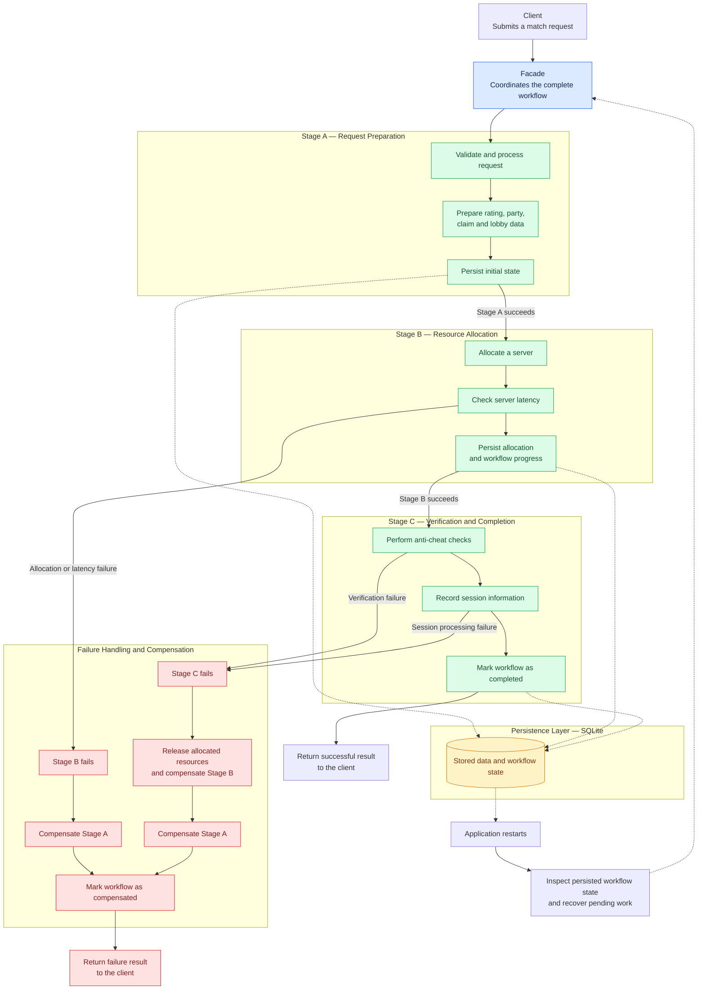

# Facade Pattern — System Architecture

```mermaid
flowchart TD
    Client["Client<br/>Submits a match request"]
    Facade["Facade<br/>Coordinates the complete workflow"]

    Client --> Facade

    subgraph StageA["Stage A — Request Preparation"]
        A1["Validate and process request"]
        A2["Prepare rating, party,<br/>claim and lobby data"]
        A3["Persist initial state"]
        A1 --> A2 --> A3
    end

    subgraph StageB["Stage B — Resource Allocation"]
        B1["Allocate a server"]
        B2["Check server latency"]
        B3["Persist allocation<br/>and workflow progress"]
        B1 --> B2 --> B3
    end

    subgraph StageC["Stage C — Verification and Completion"]
        C1["Perform anti-cheat checks"]
        C2["Record session information"]
        C3["Mark workflow as completed"]
        C1 --> C2 --> C3
    end

    Facade --> A1
    A3 -->|Stage A succeeds| B1
    B3 -->|Stage B succeeds| C1

    C3 --> Success["Return successful result<br/>to the client"]

    subgraph Persistence["Persistence Layer — SQLite"]
        DB[("Stored data and workflow state")]
    end

    A3 -.-> DB
    B3 -.-> DB
    C3 -.-> DB

    subgraph Recovery["Failure Handling and Compensation"]
        FailB["Stage B fails"]
        UndoA["Compensate Stage A"]
        FailC["Stage C fails"]
        UndoB["Release allocated resources<br/>and compensate Stage B"]
        UndoA2["Compensate Stage A"]
        Failed["Mark workflow as compensated"]
    end

    B2 -->|Allocation or latency failure| FailB
    FailB --> UndoA
    UndoA --> Failed

    C1 -->|Verification failure| FailC
    C2 -->|Session processing failure| FailC
    FailC --> UndoB
    UndoB --> UndoA2
    UndoA2 --> Failed

    Failed --> Error["Return failure result<br/>to the client"]

    DB -.-> Restart["Application restarts"]
    Restart --> Resume["Inspect persisted workflow state<br/>and recover pending work"]
    Resume -.-> Facade

    classDef facade fill:#dbeafe,stroke:#2563eb,color:#172554
    classDef stage fill:#dcfce7,stroke:#16a34a,color:#14532d
    classDef failure fill:#fee2e2,stroke:#dc2626,color:#7f1d1d
    classDef storage fill:#fef3c7,stroke:#d97706,color:#78350f

    class Facade facade
    class A1,A2,A3,B1,B2,B3,C1,C2,C3 stage
    class FailB,UndoA,FailC,UndoB,UndoA2,Failed,Error failure
    class DB storage
```
